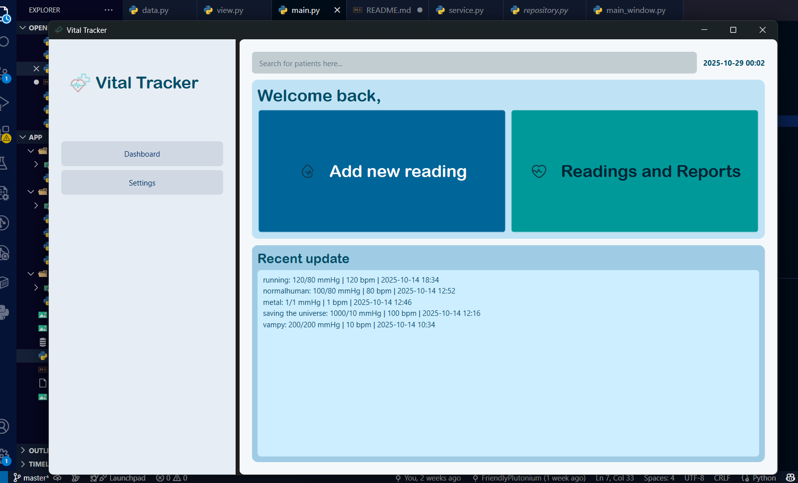
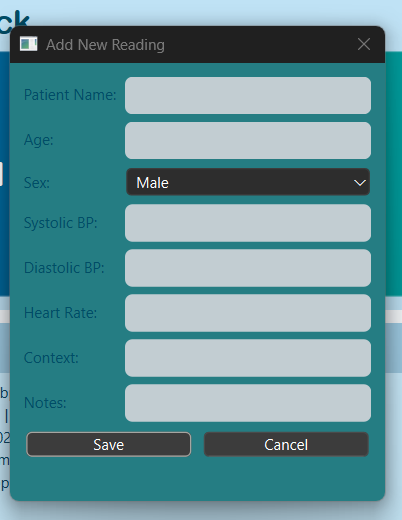
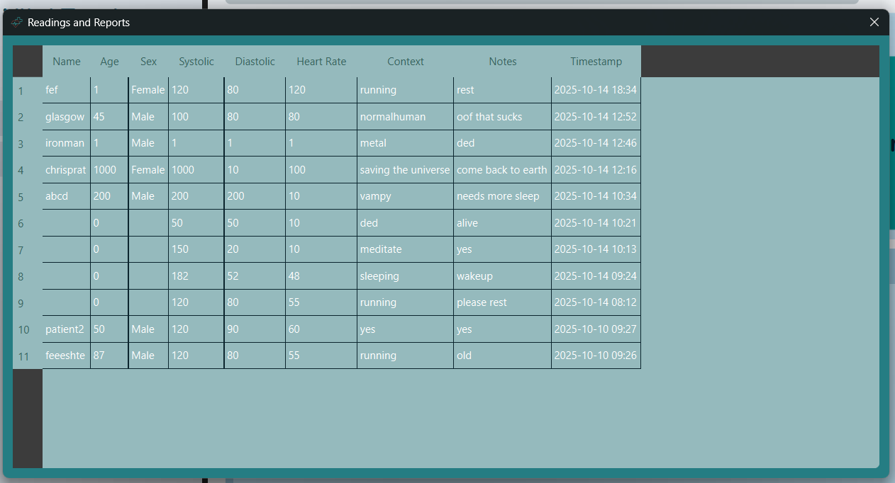

## Blood Pressure and Heart Rate Monitor

## Proponent: Fely Roshiel Ycong - BSCS

## Project Overview:
 This project aims to develop a reliable, user friendly device that records and tracks a person's vital. 

## Features:
 User can add, read, update, and delete the data they input.

## Code and Design Structures:
 Core Folder : data.py is stored. It connects the user input to database.
 Features\items Folder: model.py defines reading and patient models
                        repository.py handles all database operations for model.py
                        service.py contains validation logic that coordinate between repo and view
                        view.py builds the PyQt6 graphical interface
 Shell Folder: main_window.py integrates all layers from core folder to features
 main.py is the entry point of the program. 

# Screenshots

Dashboard View

## Add New Reading Window

## Report and Data Table

